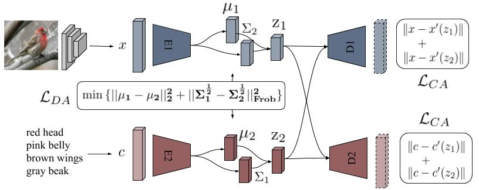

# CADA-VAE
A PyTorch implementation of "Generalized Zero-and Few-Shot Learning via Aligned Variational Autoencoders" (CVPR 2019).

Paper: https://arxiv.org/pdf/1812.01784.pdf

  

### Data
Download the following folder https://www.dropbox.com/sh/btoc495ytfbnbat/AAAaurkoKnnk0uV-swgF-gdSa?dl=0
and put it in this repository.
Next to the folder "model", there should be a folder "data".
